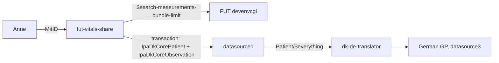

# fut-vitals-share

The citizen logs in with MitID (NemLogin) to the Danish telemedicine infrastructure FUT, which runs Telma and other citizen apps. There they choose which of their home measurements to share: heart rate, oxygen saturation and blood pressure. The module converts them to DK-Core IPA resources and writes them to the citizen's personal health record, by default the track's shared Danish source `datasource1`. From there [`dk-de-translator`](../dk-de-translator) can translate them and send them on to the German GP.



It is a copy of the citizen app from [ehealth-reference-clients](https://github.com/fut-infrastructure/ehealth-reference-clients) (commit `72b1281`, Apache 2.0). It adds one page, **Share measurements** (`/share`). The rest of the reference app (My week, My profile, submitting measurements) still works.

## Output

The output is one transaction Bundle:

| Resource | Profiles |
|---|---|
| Patient | `http://hl7.dk/fhir/core/StructureDefinition/ipa-dk-core-patient` |
| Observation (heart rate) | `.../ipa-dk-core-observation` + `http://hl7.org/fhir/StructureDefinition/heartrate` |
| Observation (SpO2) | `.../ipa-dk-core-observation` + `http://hl7.org/fhir/StructureDefinition/oxygensat` |
| Observation (blood pressure) | `.../ipa-dk-core-observation` + `http://hl7.org/fhir/StructureDefinition/bp` |

How FUT data is mapped (`IpaDkCoreMapper`, `VitalSign`):

- **Codes.** LOINC is added (8867-4, 2708-6, 85354-9 with components 8480-6 and 8462-4). FUT's own codes are kept, with the OIDs replaced by the code system URLs DK-Core slices on: NPU `urn:oid:1.2.208.176.2.1` becomes `http://npu-terminology.org`, and MedCom `urn:oid:1.2.208.184.100.8` becomes `http://medcomfhir.dk/ig/terminology/CodeSystem/medcom-observation-codes`.
- **Units.** All values use UCUM (`/min`, `%`, `mm[Hg]`). An SpO2 given as a fraction (NPU) is converted to a percentage.
- **Blood pressure.** Separate systolic (DNK05472) and diastolic (DNK05473) Observations with the same time are paired into one `bp` panel. FUT Observations with components are mapped directly.
- **Patient.** CPR, name (`use = official`), gender, birth date and address. If the CPR number is missing, nothing is shared.
- **No duplicates.** The Patient is created with `ifNoneExist` on the CPR number. Each Observation gets the [PHD IG's conditional-create identifier](https://hl7.org/fhir/uv/phd/StructureDefinition-PhdBaseObservation.html#ccidentifier) and is created with `ifNoneExist` on it (`PhdIdentifier`):

  ```
  system: http://hl7.org/fhir/uv/phd/StructureDefinition/PhdBaseObservation
  value:  <device>-<CPR>-urn:oid:1.2.208.176.1.2-<MDC>-<timestamp>[..<duration>]
  e.g.    74E8FFFEFF051C00-1109859996-urn:oid:1.2.208.176.1.2-150456-841564800+8
  ```

  | Part | From FUT |
  |---|---|
  | device | The IEEE 11073 system id (EUI-64, otherwise EUI-48/Bluetooth) in `Device.identifier` on the FUT Device that `Observation.device` points to. Recognised by system `urn:oid:1.2.840.10004.1.1.1.0.0.1.0.0.1.2680` / `http://hl7.org/fhir/sid/eui-48/bluetooth` or type `SYSID` / `BTMAC`. Written as hex, capitals, without separators. |
  | patient | CPR value and system |
  | type | MDC: heart rate 149546 (`MDC_PULS_RATE_NON_INV`), SpO2 150456, blood pressure 150020 |
  | timestamp | `effective[x]` as seconds since 2000-01-01, with three decimals when the time has milliseconds, followed by the UTC offset in quarters of an hour (`+8` = +02:00). A period with a length adds `..<seconds>`. |

  **Without a PHD identifier the conditional create uses FUT's own business identifier** (`http://ehealth.sundhed.dk/id/ehealth-identifier`, a UUID, copied to the exported Observation). That prevents duplicates when the same FUT measurement is shared again, but not across routes. In Anne's Telma data **no Observation references a Device**, not even the automatically transferred heart rate and SpO2 measurements, so for now all measurements use the FUT identifier. The share page shows the key per measurement ("PHD …" or "FUT …"). The FUT Observation a measurement came from is recorded in `meta.source`.

The output validates without errors against DK-Core 3.7.0 and the vital-signs profiles with `$validate` on datasource1. The only warnings are that LOINC and NPU cannot be checked there (no terminology server), that IPA is not loaded, and that the resources have no narrative.

The **Download as FHIR Bundle** button gives the same transaction as a file, without sending it, for use with other components.

## Running

You need Java 21 and Maven (or `./mvnw`), plus network access to `*.devenvcgi.ehealth.sundhed.dk` and the PHR server.

```sh
./run.sh        # http://localhost:8090
```

`run.sh` reads the datasource credentials from `../dk-de-translator/.env` (or `PHR_USERNAME` / `PHR_PASSWORD`). It uses FUT devenvcgi with the preregistered client `ehealth-reference-citizen-client`. Other environments: `FUT_ENV=test ./run.sh`, plus your own client ID if needed. To write somewhere other than datasource1, set `PHR_URL`.

Log in with "Log ind" using the MitID test identity for Anne Sørensen (CPR 110985-9996), then open **Share measurements**.

The measurements are read from all of the citizen's active episodes of care over the last 365 days (`$search-measurements-bundle-limit` on the measurement server, with the token scoped to each episode).

## Tests

```sh
mvn verify
```

`IpaDkCoreMapperTest` covers the mapping.

## Known gaps

- The FUT codes are taken from the FUT value set `observation-codes` (NPU21692, NPU03011, DNK05472/DNK05473) and have not yet been checked against Anne's actual Telma data. Other codes (e.g. MedCom MCS88xxx) are added in `VitalSign` when they show up.
- The Patient is created conditionally. If Anne already exists on the server (e.g. from `anne-dk-bundle.json`), the existing Patient is kept unchanged and the Observations point to it.
- **The PHD identifier is an approximation.** PHD wants the timestamp the device reported. FUT keeps only `effective[x]`, so another PHD gateway gets the same identifier only if FUT stored the device's time unchanged. FUT cannot tell a heart rate from a blood pressure monitor (149546) from one from a pulse oximeter (149530); 149546 is used. Neither has been tested against real FUT devices, so it is not yet known whether Telma's Devices have an IEEE id at all.
- The PHD IG's timestamp example (2021-11-22 11:56:30 → `690897360.567`) looks 30 seconds off; the correct count is 690897390. The code follows the rule, not the example.
- Sharing is recorded in no Consent resource. The citizen's choice is the selection on the page.
- Device and method information from FUT is not carried over.
